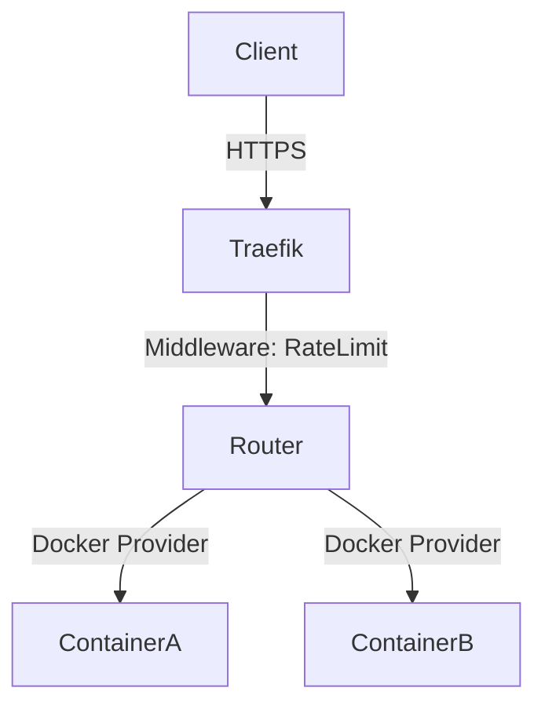

# ?? Traefik Edge Router (`devops-traefik`)

## 1. Project Purpose
Provide a dynamic, auto-discovering reverse proxy that terminates TLS securely and applies global security middlewares to all containerized traffic.

## 2. Problem Being Solved
Managing Nginx configuration files manually for dozens of microservices is error-prone and requires proxy reloads, causing dropped connections. 

## 3. Architecture Diagram

## 4. Technology Stack
- Traefik v3
- Let's Encrypt (ACME)
- Docker Compose

## 5. Features
- Zero-downtime dynamic routing via Docker labels.
- Automated Let's Encrypt certificate lifecycle.
- Global HTTP to HTTPS redirection.
- Built-in security and rate-limiting middlewares.

## 6. Repository Structure
- `docker-compose.yml`: Proxy deployment.
- `traefik.yml`: Static configuration.
- `dynamic.yml`: Middleware definitions.
- `ADR/`: Architecture decisions.

## 7. Quick Start
`docker compose up -d`

## 8. Configuration
Modify `traefik.yml` to set the Let's Encrypt email address.

## 9. Testing
Deploy a sample whoami container with Traefik labels to verify routing and TLS termination.

## 10. Security
See [SECURITY.md](SECURITY.md) for Docker socket risks.

## 11. Observability
Traefik exposes an internal dashboard (`api@internal`) protected by BasicAuth. Metrics can be scraped by Prometheus via the `/metrics` endpoint.

## 12. Failure Scenarios
If Traefik crashes, all ingress traffic drops. Docker's `restart: always` handles automatic recovery.

## 13. Performance
Traefik is written in Go and can handle tens of thousands of requests per second.

## 14. Deployment
Deployed as a standalone orchestrator on the host machine.

## 15. Rollback
Version pinned to `v3.0`. Rollback involves modifying the tag and running `docker compose up -d`.

## 16. Disaster Recovery
See [DISASTER_RECOVERY.md](DISASTER_RECOVERY.md).

## 17. Design Decisions
- [ADR-001: TLS Termination](ADR/001-tls-termination.md)
- [ADR-002: Dynamic Configuration](ADR/002-dynamic-config.md)

## 18. Limitations
Not clustered. In a multi-node environment, Traefik must be deployed in high-availability mode utilizing a KV store (Consul/etcd) for certificate synchronization.

## 19. Future Improvements
Implement CrowdSec bouncer middleware for dynamic IP banning.
